# personal
nabilaazzahra

Studi kasus ini bertujuan untuk membangun sebuah aplikasi web personal yang bersifat dinamis, di mana pemilik web dapat mengelola konten secara mandiri melalui halaman admin. Aplikasi dikembangkan menggunakan PHP dan menyimpan data menggunakan database MySQL. Tampilan antarmuka dirancang menggunakan Tailwind CSS agar responsif, modern, dan mudah dikustomisasi.

Website ini memiliki dua bagian utama:
1. Halaman Publik, yang dapat diakses oleh semua pengunjung.
2. Halaman Admin, yang hanya dapat diakses setelah login, digunakan untuk mengelola konten.

**Fitur-fitur**
1. Login & Logout (Halaman login admin dengan validasi, Sistem sesi untuk melindungi halaman admin, Logout untuk mengakhiri sesi dengan aman)
2. Manajemen Artikel (Tambah artikel (judul + isi), Edit artikel yang sudah ada, Hapus artikel, Tampilkan daftar artikel di halaman utama, Sidebar "Daftar Artikel" yang terupdate otomatis)
3. Manajemen Gallery (Upload gambar beserta judul, Ganti gambar dan judul yang sudah ada, Hapus gambar, Tampilkan gambar di halaman galeri publik dalam grid responsif)
4. Manajemen About (Tambah deskripsi tentang diri, Edit dan hapus bagian “About”, Tampilkan deskripsi di halaman publik about.php)
5. Dashboard Statistik Admin (Menampilkan ringkasan jumlah: Artikel & Gambar di gallery)
6. Halaman Publik yang Rapi & Dinamis (Artikel terbaru ditampilkan otomatis, Galeri responsif dan ringan, Tentang Saya tampil dengan struktur informatif)

**Teknologi yang Digunakan**
1. Bahasa Pemrograman : PHP
2. Database : MySQL
3. Frontend : Tailwind CSS, HTML
4. Server Side : Apache / XAMPP

## Dokumentasi UI Publik

### Halaman Home (Artikel)
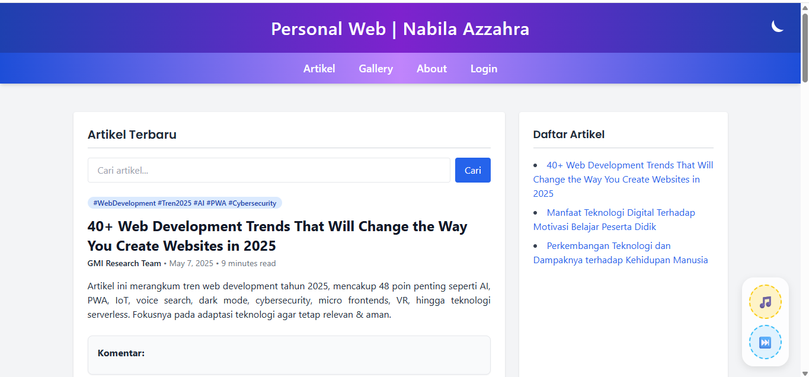

### Halaman Gallery
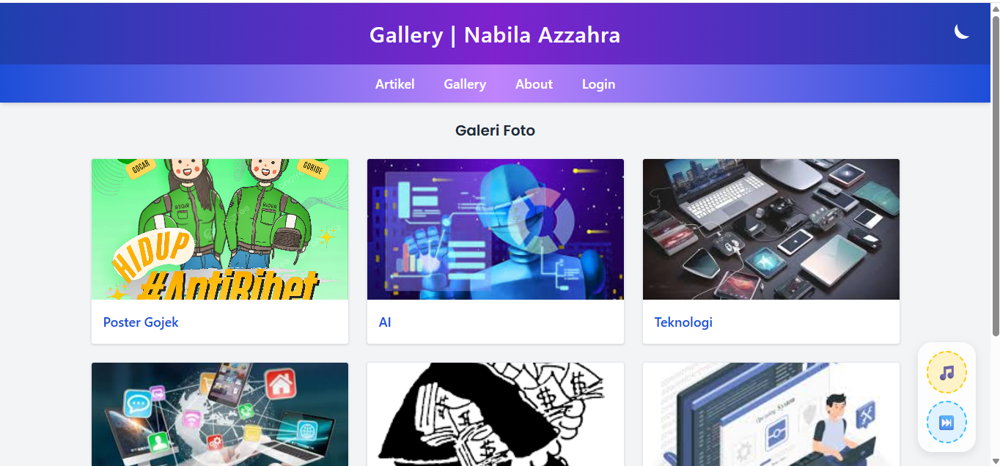

### Halaman About
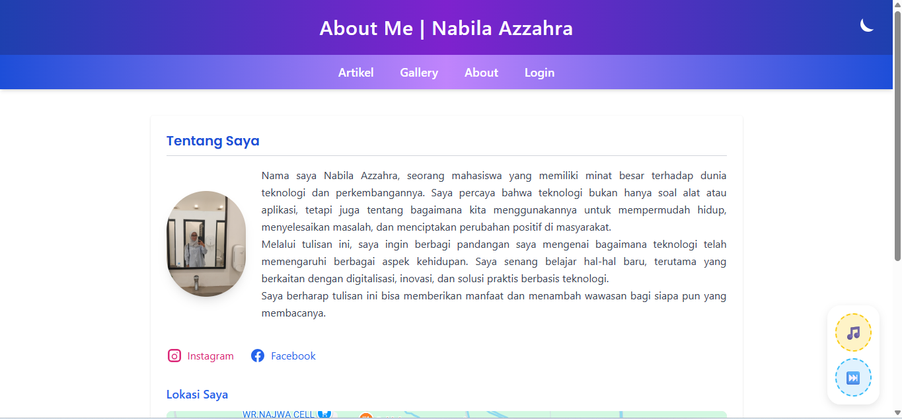

## Dokumentasi UI Admin

### Halaman Login
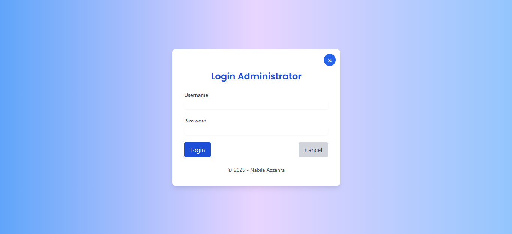

### Halaman Beranda (Dashboard Admin)
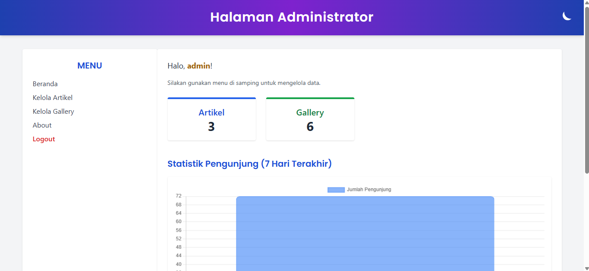

### Kelola Artikel
- Tampil Artikel  
  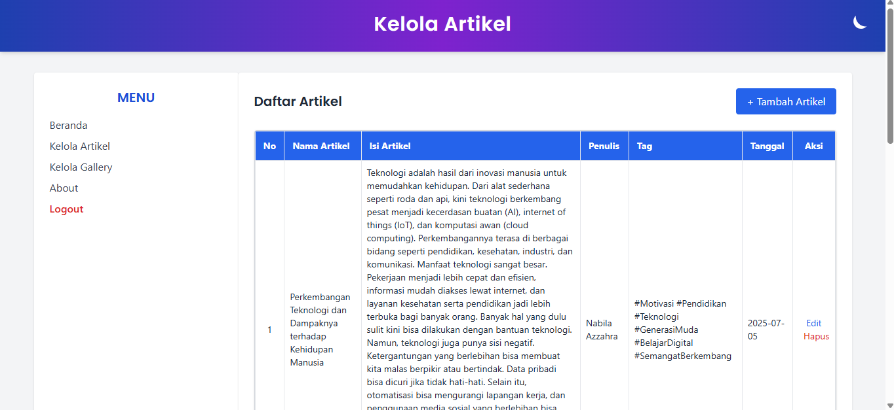
- Edit Artikel  
  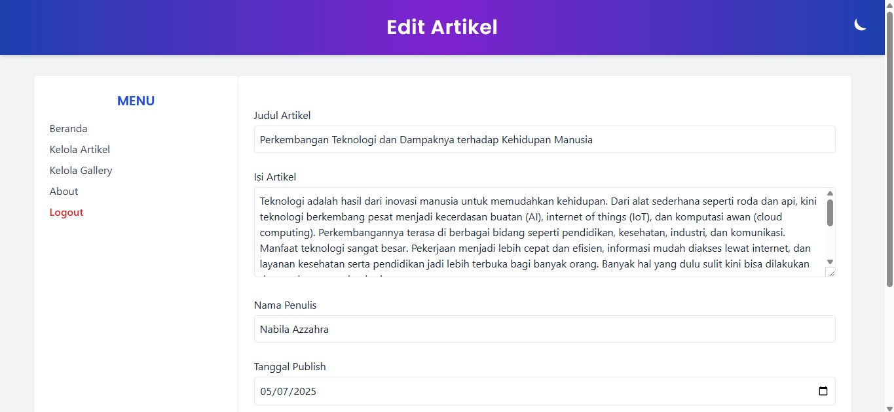
- Tambah Artikel  
  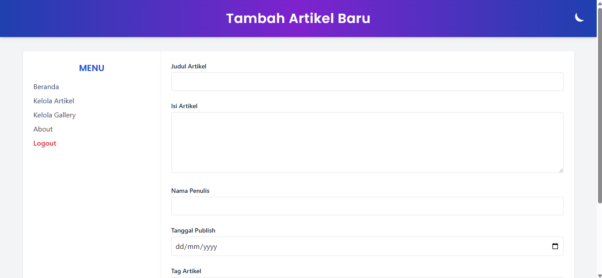

### Kelola Gallery
- Tampil Gallery  
  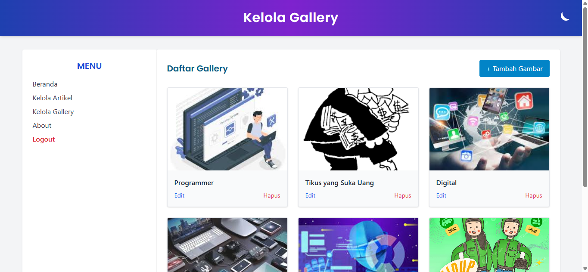
- Edit Gallery  
  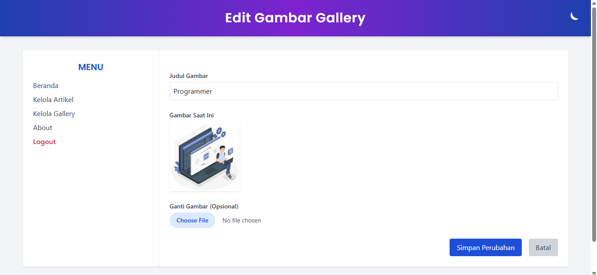
- Tambah Gallery  
  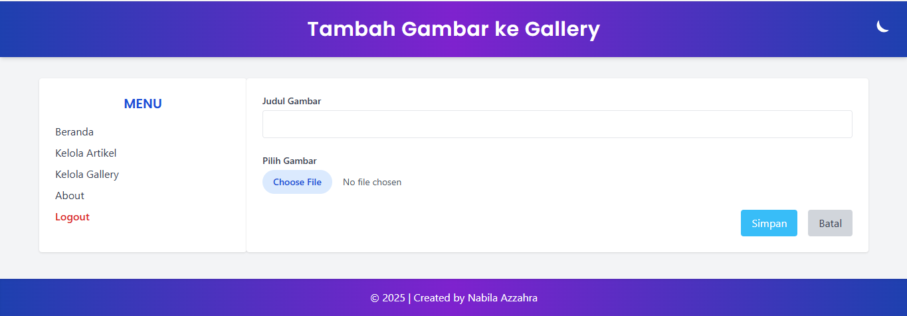

### Kelola About
- Tampil About  
  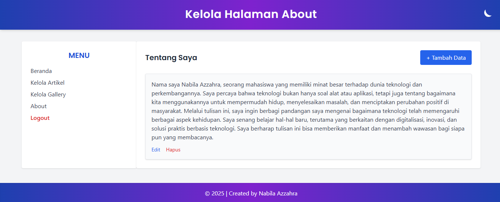
- Edit About  
  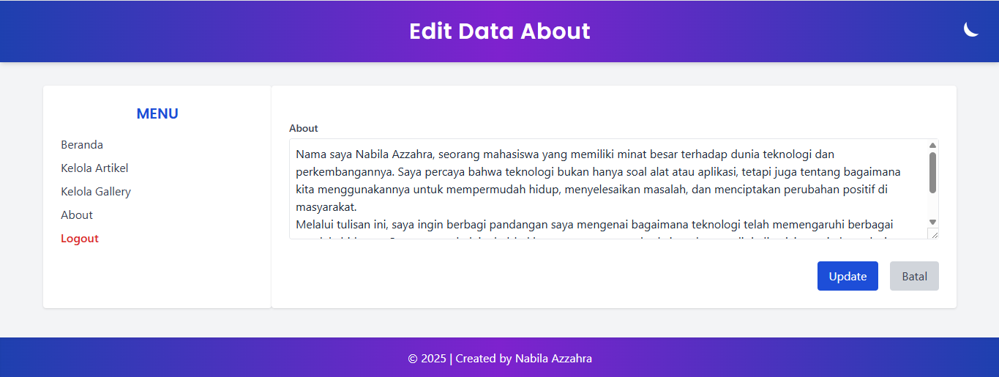
- Tambah About  
  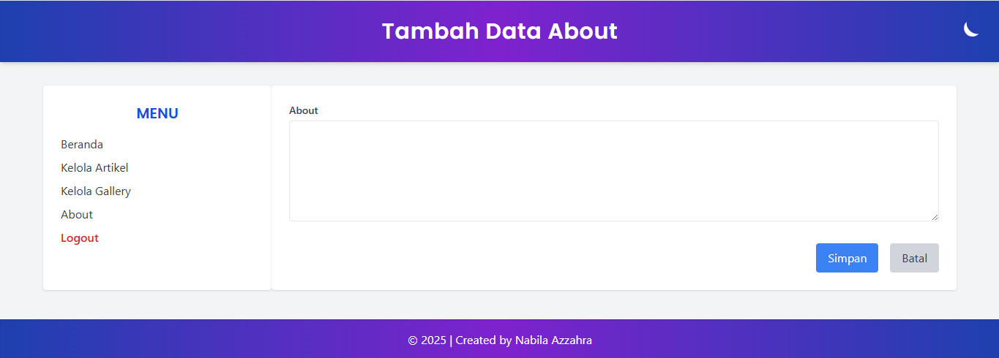

## Fitur Tambahan

### Struktur Folder / Project
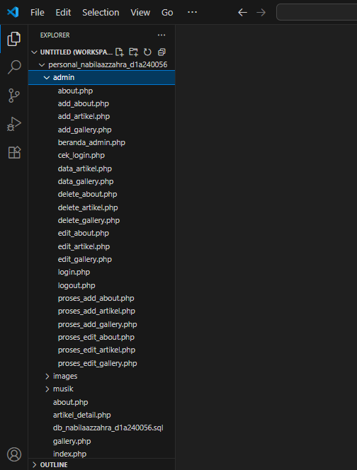
